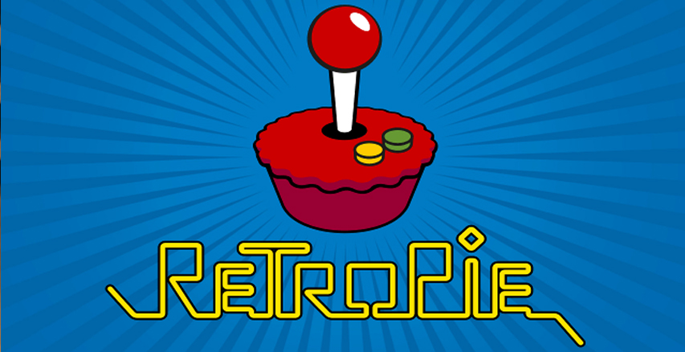
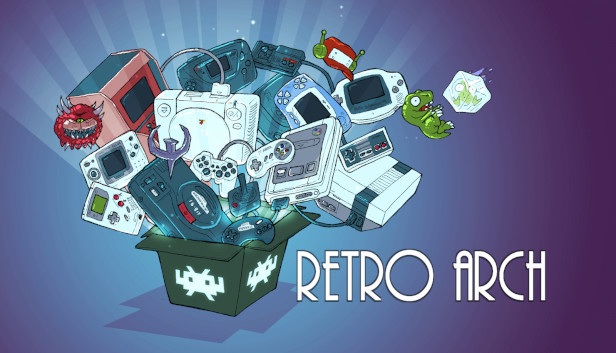

# Documentation Caiman

## Diplôme de Technicien ES en informatique

Table des matières

- [Documentation Caiman](#documentation-caiman)
  - [Diplôme de Technicien ES en informatique](#diplôme-de-technicien-es-en-informatique)
- [Résumé](#résumé)
- [Abstract](#abstract)
- [Remerciement](#remerciement)
- [Introduction](#introduction)
  - [Contexte](#contexte)
  - [Motivations](#motivations)
- [Cahier des charges](#cahier-des-charges)
  - [Spécification](#spécification)
    - [Emulateurs et contrôles](#emulateurs-et-contrôles)
    - [Création d’un compte utilisateur](#création-dun-compte-utilisateur)
    - [Interface](#interface)
    - [Paramètre graphiques](#paramètre-graphiques)
    - [Gestion des sauvegardes](#gestion-des-sauvegardes)
    - [Spécifications du “Bunker”](#spécifications-du-bunker)
    - [Spécification site web (site présent dans le Bunker)](#spécification-site-web-site-présent-dans-le-bunker)
    - [Installation](#installation)
  - [Limites du Projet](#limites-du-projet)
  - [Calendrier](#calendrier)
  - [Matériel](#matériel)
  - [Livrables](#livrables)
- [Étude d’opportunité](#étude-dopportunité)
  - [RetroPie](#retropie)
  - [RetroArch](#retroarch)
  - [RomStation](#romstation)
  - [Steam](#steam)
  - [Gog](#gog)
- [Analyse fonctionnelle](#analyse-fonctionnelle)
  - [Site web Caiman](#site-web-caiman)
    - [Création de compte](#création-de-compte)
    - [connexion](#connexion)
    - [modification des informations d’un utilisateur](#modification-des-informations-dun-utilisateur)
    - [affichage des jeux](#affichage-des-jeux)
    - [affichage d’un profils utilisateur](#affichage-dun-profils-utilisateur)
    - [ajout d’un jeu à la base de données / sur le Bunker pour le fichier .ISO](#ajout-dun-jeu-à-la-base-de-données--sur-le-bunker-pour-le-fichier-iso)
    - [modification d’un jeu](#modification-dun-jeu)
    - [Téléchargement](#téléchargement)
  - [Application  Caiman C](#application--caiman-c)
    - [Connexion](#connexion-1)
    - [Inscription](#inscription)
    - [Téléchargement de jeu](#téléchargement-de-jeu)
    - [Lancement d’un jeu](#lancement-dun-jeu)
    - [Synchronisation des sauvegarde entre le pc client et le Bunker](#synchronisation-des-sauvegarde-entre-le-pc-client-et-le-bunker)
    - [Modification de la configuration utilisateur](#modification-de-la-configuration-utilisateur)
    - [Application de la configuration utilisateur](#application-de-la-configuration-utilisateur)
    - [Gestion des manettes](#gestion-des-manettes)
  - [interface utilisateur utilisable à la manette](#interface-utilisateur-utilisable-à-la-manette)
    - [Réception des input des manettes connecté](#réception-des-input-des-manettes-connecté)
    - [Envoie des input a la form active dans l’application](#envoie-des-input-a-la-form-active-dans-lapplication)
    - [Transformation des input de la manette en événement](#transformation-des-input-de-la-manette-en-événement)

# Résumé

Ce document décrit le processus de conception de mon projet Caiman. Caiman est inspiré par des applications comme Retropie, RetroArch ou Steam. RetroPie est une distribution pour raspberry comprenant des émulateurs pour d'anciennes consoles de jeu. RetroArch est lui une application servant de frontend pour émulateur, RetroArch est disponible sur plusieurs plateformes(Windows, macOS, Xbox).

Caiman est un projet comprenant deux parties distinctes. La première partie consiste en un site web PHP permettant de se créer un compte et de s'identifier. Le site web permet de consulter des Informations sur les jeux présent sur sur le store ainsi que de pouvoir administrer les site et le store.

La deuxième partie du projet est un application C# inspiré par le mode Big Picture de steam. Caiman sert de frontend pour différents émulateurs (Dolphin, PCSX2,etc). L’application permet de télécharger les différents jeux qui ont été ajoutés au store prévu pour le projet. Les jeux pris en charge sont ajoutés par des administrateurs via le site internet de Caiman. L’application permet de synchroniser les sauvegardes de l’utilisateur et cela peut importe sur quel pc il lance l’application. 

# Abstract

# Remerciement

# Introduction

## Contexte

Caiman à été réalisé dans le cadre du travail de diplôme de technicien deuxième année. La réussite du travail de diplôme est l’une des conditions pour recevoir son titre de technicien en informatique.

## Motivations

Le choix de ce travail de diplôme découle de mon envie de faire un travail de diplôme qui serait intéressant, ludique et en lien avec le jeu vidéo. La réalisation d’un jeu vidéo étant trop compliquée pour un travail de diplôme, j'ai décidé de créer une application a mi-chemin entre un launcher de jeu comme Steam ou GOG et un gestionnaire de VM.

J’utilise depuis des années des émulateurs et je me heurte souvent aux mêmes problèmes, perte de sauvegarde dû à une réinstallation de windows, problème pour ripper mes jeux, téléchargement de chaque émulateur un par un. J’ai donc eu l’idée de créer Caiman pour pallier ces différents problèmes.

Un autre aspect important pour moi est la simplicité, je voulais que l'utilisation de l'application soit le plus simple possible une personne sans connaissance particulière en informatique doit pouvoir utiliser Caiman sans soucis. Une autre spécification est que l’utilisation de Caiman puisse se faire à la manette. Pour créer une interface ergonomique je me suis basé sur l’interface Big Picture de Steam qui a justement été créé pour être utilisé  a la manette.

# Cahier des charges

## Spécification

### Emulateurs et contrôles

Les différents émulateurs qui permettent d'exécuter des jeux dans Caiman sont:

*   PCSX2 (playstation 2)
*   Dolphin (gamecube / wii)

L’utilisateur doit utiliser une manette de Xbox pour utiliser Caiman à la manette (une seule manette est requise pour jouer mais plusieurs peuvent être connectées, pour jouer en multijoueurs local).

Caiman est utilisable à la manette à l'exception des formulaires. (création de compte, importation de jeux)

### Création d’un compte utilisateur

L’utilisateur a l’obligation de créer un compte pour pouvoir utiliser Caiman.

L’utilisateur peut créer un compte directement depuis Caiman s'il n’en possède pas.

### Interface

Dans l'interface, un système de catégories existe pour permettre de se retrouver plus simplement dans la liste des jeux à télécharger. Les différentes catégories sont créées par un administrateur.

Exemple de catégories:

*   jeux Mario
*   jeux Zelda
*   jeux d’aventure
*   jeux de réflexion
*   jeux multijoueur
*   jeux favoris
*   etc..

L’utilisateur peut ajouter depuis Caiman des jeux favoris pour pouvoir les retrouver plus facilement. ( une catégorie “favoris” est visible contenant les jeux favoris de l’utilisateur authentifié )

### Paramètre graphiques

L’utilisateur a la possibilité de modifier certains paramètres d’émulation:

*   La définition des jeux (définition native, proche de 1080p, proche de 4K).
*   La langue des machines.
*   Si les jeux doivent être lancés en plein écran ou non.
*   Format d’écran 16/9 ou 4/3.

### Gestion des sauvegardes

Il existe plusieurs cas où les sauvegardes de l’utilisateur se synchronisent:

1. Le joueur sauvegarde sa partie directement dans un jeu depuis Caiman. La sauvegarde que l’utilisateur vient de créer est envoyée sur le Bunker et remplace la version présente.
2. Quand le joueur lance Caiman, une vérification est faite pour savoir si une version plus récente des sauvegardes du joueur sont présentes, si c’est le cas elles sont téléchargées sur la machine du joueur.

### Spécifications du “Bunker” 

Le Bunker contient les fichiers des différents jeux au format (.ISO).

Le Bunker contient les fichiers de sauvegardes des utilisateurs. Ces sauvegardes seront envoyées de la machine de l’utilisateur vers le Bunker quand l’utilisateur sauvegarde sa partie depuis un jeu.

Les données des utilisateurs (email, jeux favoris, heures de jeux) sont stockées dans une base de données.

### Spécification site web (site présent dans le Bunker)

Sur le site web il est possible de créer un compte en spécifiant un mail et un mot de passe.

L’interface web permet de rechercher des utilisateurs pour voir leur profil.

L’affichage d’un profil permet de voir les jeux favoris d’un utilisateur ainsi que son nombre d'heures de jeu sur chaque jeu.

Le site web permet à un administrateur d’ajouter des jeux et de modifier les informations des jeux.

Le site web permet de modifier les informations de compte d’un utilisateur.

Un utilisateur peut faire la demande de réinitialiser son mot de passe.

### Installation

Caiman est téléchargeable depuis le site web. L'installateur contient les émulateurs, il n’y a donc rien à télécharger d’autre.

## Limites du Projet

Caiman sera limité au jeux que j’ai pu ajouter moi même ainsi qu’aux émulateurs que j’aurais importé, la totalité des consoles de jeux ne sera donc pas prise en charge.

## Calendrier

Le début du travail de diplôme est fixé au lundi 19 avril et le rendu est fixé au 11 juin à 12h00.

Le travail est à exécuter soit en présentiel et en télétravail du lundi au vendredi et cela 8h00 par jour.

## Matériel

*   Mon pc pour le développement
    *   Intel i7-7700 3.6 GHz
    *   32 GB de ram
    *   GTX 1060 3GB
*   Un serveur pour héberger le site et les fichiers du store
*   Une manette de Xbox Series

## Livrables

- Code source
- Planning effectif
- Planning prévisionnel
- Journal de bord
- Documentation technique
- Manuel utilisateur
- Poster
- Journal de bord
- Résumé

# Étude d’opportunité

## RetroPie

RetroPie est une distribution Linux prévue pour Raspberry et PC est un frontend pour pour jouer au jeux d’arcade, d’ancienne console et de jeu pc. Retropie est à la différence de Caiman un OS à part entière et chaque jeu doit être ajouté indépendamment par l’utilisateur sur le Rasberry/PC.

## RetroArch

RetroArch est un frontend pour émulateurs, moteur de jeu et media players. Il embarque un très grand nombre d’émulateurs et a l’avantage d'être disponible sur un très grand nombre de plateformes.

RetroArch possède des fonctionnalités très utiles comme des Shaders intégré, le jeux en réseau, le calcul du temps entre les frames, et d’autres. C’est surement le Frontend pour émulateur le plus complet disponible.

L’interface de RetroArch est inspirée par le XMB de la Playstation 3 et de la PSP ce qui le rend compatible avec une manette.

RetroArch est disponible sur:

*   Windows
*   Linux
*   Raspberry
*   Android
*   Apple macOS (ARM/x64)
*   Apple macOS/OSX
*   IOS/Apple TV
*   Xbox Series / One
*   OpenDingux
*   PSvita
*   PSP
*   PS2
*   PS3
*   PS4
*   Switch
*   WII U
*   WII
*   Gamecube
*   3DS / 2DS

## RomStation

## Steam

## Gog

# Analyse fonctionnelle

## Site web Caiman

### Création de compte

### connexion

### modification des informations d’un utilisateur

### affichage des jeux

### affichage d’un profils utilisateur

### ajout d’un jeu à la base de données / sur le Bunker pour le fichier .ISO 

### modification d’un jeu

### Téléchargement

## Application  Caiman C#

### Connexion

### Inscription

### Téléchargement de jeu

### Lancement d’un jeu

### Synchronisation des sauvegarde entre le pc client et le Bunker

### Modification de la configuration utilisateur

### Application de la configuration utilisateur

### Gestion des manettes

## interface utilisateur utilisable à la manette

### Réception des input des manettes connecté

### Envoie des input a la form active dans l’application

### Transformation des input de la manette en événement 
