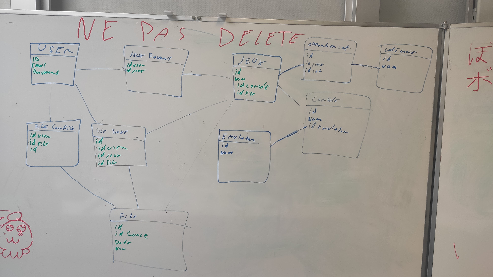

# Caiman

## 19.04.2021

### 8h05

Entretiens avec M. Garcia

### 9h05

Copie de mon disque pour Gawen

### 9h20

Création du git

### 9h30

je réflechi a ce par quoi je vais commencer j'hésite entre commencer entre le site web ou les téléchargement

### 9h40

Modélisation de la BDD

### 10h30

Installation de laragon 

### 10h40

Création de la base de données

### 12h40

Création de la structure du site web

### 14h35

Création des diférente pages et mise en place de bootstrap

### résumé

j'ai créer la base de donnée et le site web

--------

## 20.04.2021

### 8h05

je continue a créer le site web je crée les formulaires pour la connexion

### 15h20

J'ai implémenter la création de compte et la connexion le mail doit étre unique et le username aussi.

j'ai selon les idication de M. Schmid utilisé les fonctions

password_hash et password_verify de php.

### 15h30

j'ajoute des donnée a la main dans la bdd

### 15h56

aide de M.Schmid pour du sql

-----------

## 21.04.2021

### 8h10

Modification de la structure du site et ajout de l'update de mots de passe

### 13h00

l'affichage des jeux est disponible ainsi que une recherche sur les jeux grace a leurs noms.

### 13h20

Ajout de champs dans la table game
- description
- imageName

### 15h00

l'affichage de la recherche et du détail d'un jeu fonctionne mais n'est pas belle.

------------

## 22.04.2021

### 8h05

Ajout de laffichage des categories de chaque jeu

### 9h00

Affichage des jeux qui appartienne a une catégorie.

### 10h20

modification de l'interface de recherche

### notes personnelles

- je dois ajouter une table pour savoir le nombre d'heure de jeu de chaque utilisateurs
- je dois ajouter une gestion des message d'erreurs.
- je peux ajouter une photo de profil
  

### 11h0

modification de l'interface de connexion et de d'inscription

### 11h50

supression de la page de création de compte

### 12h40

Ajout d'un jeux en favoris

### 15h00

suppresion d'un jeu en favoris

### a faire demain

- l'affichage des card dans le dashboard n'est pas bon

--------

## 23.04.2021

### 8h05

modification de la l'interface du Dashboard

### 8h40

Ajout d'un champ dans la table utilisateur pour spécifier si l'utilisateur est privé ou non
si l'utilisateur n'est pas privé tous le monde va pouvoir voir son profils

### 9h30

la modifivation du paramétre pour savoir si le compte est privé ou non

### 12h20

test de Git Hook

### 13h30

modification de l'interface theme blanc -> dark

### 15h20

test de téléchargement de fichiers deouis le poste utilisateur

### notes pour la prochaine fois

- Je dois créer la partie Administrateur du site
- Je dois créer un une fonctionnalité qui me permet de gerer les messages d'erreurs
- Je dois sécuriser l'acces au pages
- je dois sécuriser les différents formulaires
- je dois je dois me reinseigner comment uploader des gros fichier depuis un poste clients
- je dois changer de navbar

----------

## 26.04.2021

### 8h05

notes personneles:

- je dois ajouter la posibilité d'afficher la page d'un utilisateur
- je dois corriger mon script d'export de base de données

### 8h10

Creation de la page dédie aux administrateurs.

### 8h30 

Ajout de catégorie

### 9h00

Ajout de jeu

### notes personnels

j'ai regarder plusieurs méthodes pour envoyer un fichier depuis un formulaire en php. Pour l'instant jutilise les fonctions de base de php et elle fonctionne donc je vais faire des tests une fois le site uploadé sur le Bunker.

### 11h00 

le fichier .iso est uploadé avec le bon nom mais pas encore dans la base de données

### 15h00

Le jeu est bien ajouté ave le bon nom ainsi que la bonne image.

### 15h45

il est maintenant possible de mettre a jour le nom, la description ou la console d'un jeu.

### 15h50

modification de la structure du git

-----

## 27.04.2021

### 8h05

ajout/ suppression de catégories a un jeu

### 9h20 

modification mineur de l'interface

### 10h05

recherche d'un profil utilisateur

### 12h15

la recherche et l'affichage d'un profil utilisateur est fonctionnel

### 13h00

modification de l'interface pour que les jeux s'affiche correctement

### 13h30

Le site est fonctionnel mais il manque des détail comme les message d'erreur et les droit sur les pages

### notes personelles

pour finir le site il me reste les choses suivante a faire:
- Sécuriser les pages
- afficher des messages d'erreur
- suppresion de catégories
- suppresion de jeu
- mot de passe oublié
- commenter mon code
- pagination pout les recherches

### 13h40

documentation