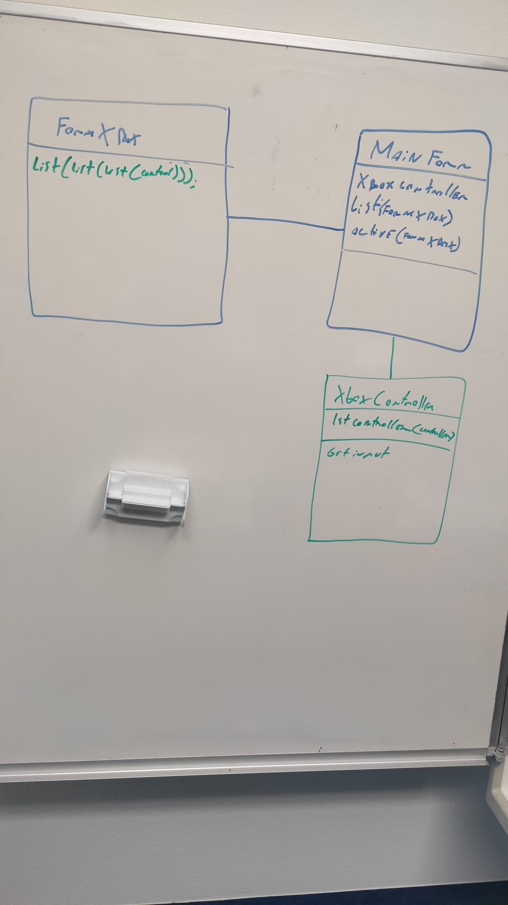
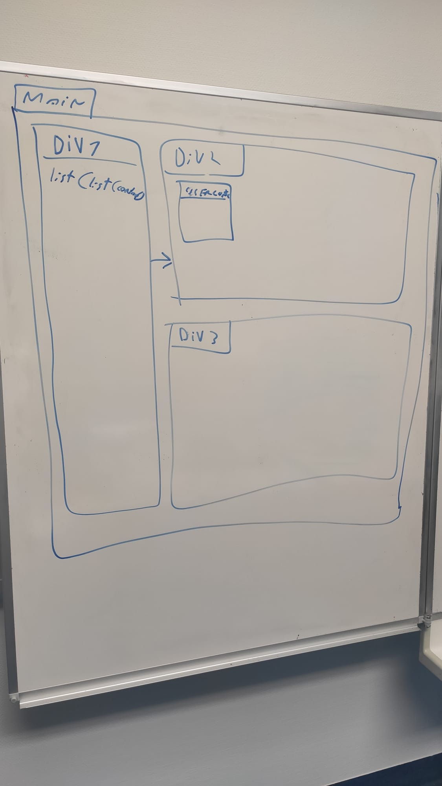

# Caiman

## 19.04.2021

### 8h05

Entretiens avec M. Garcia

### 9h05

Copie de mon disque pour Gawen

### 9h20

Création du git

### 9h30

je réfléchi à ce par quoi je vais commencer j'hésite entre commencé entre le site web ou les téléchargement

### 9h40

Modélisation de la BDD

### 10h30

Installation de laragon 

### 10h40

Création de la base de données

### 12h40

Création de la structure du site web

### 14h35

Création des différente pages et mise en place de bootstrap

### résumé

j'ai créer la base de donnée et le site web

--------

## 20.04.2021

### 8h05

je continue à créer le site web je crée les formulaires pour la connexion

### 15h20

J'ai impliqué la création de compte et la connexion, le mail doit être unique et le username aussi.

j'ai selon les indication de M. Schmid utilisé les fonctions

password_hash et password_verify de php.

### 15h30

j'ajoute des donnée a la main dans la bdd

### 15h56

aide de M.Schmid pour du sql

-----------

## 21.04.2021

### 8h10

Modification de la structure du site et ajout de l'update de mots de passe

### 13h00

l'affichage des jeux est disponible ainsi qu'une recherche sur les jeux grâce à leurs noms.

### 13h20

Ajout de champs dans la table game
- description
- imageName

### 15h00

l'affichage de la recherche et du détail d'un jeu fonctionne mais n'est pas beau.

------------

## 22.04.2021

### 8h05

Ajout de l'affichage des catégories de chaque jeu

### 9h00

Affichage des jeux qui appartiennent à une catégorie.

### 10h20

modification de l'interface de recherche

### notes personnelles

- je dois ajouter une table pour savoir le nombre d'heure de jeu de chaque utilisateurs
- je dois ajouter une gestion des messages d'erreurs.
- je peux ajouter une photo de profil
  

### 11h0

modification de l'interface de connexion et de d'inscription

### 11h50

suppression de la page de création de compte

### 12h40

Ajout d'un jeux en favoris

### 15h00

suppression d'un jeu en favoris

### a faire demain

- l'affichage des card dans le dashboard n'est pas bon

--------

## 23.04.2021

### 8h05

modification de la l'interface du Dashboard

### 8h40

Ajout d'un champ dans la table utilisateur pour spécifier si l'utilisateur est privé ou non
si l'utilisateur n'est pas privé tout le monde va pouvoir voir son profils

### 9h30

la modification du paramètre pour savoir si le compte est privé ou non

### 12h20

test de Git Hook

### 13h30

modification de l'interface theme blanc -> dark

### 15h20

Création de la page de téléchargement et mise en place de du téléchargement de Caiman depuis le site

### notes pour la prochaine fois

- Je dois créer la partie Administrateur du site
- Je dois créer un une fonctionnalité qui me permet de gérer les messages d'erreurs
- Je dois sécuriser l'accès au pages
- je dois sécuriser les différents formulaires
- je dois je dois me renseigner comment uploader des gros fichier depuis un poste clients
- je dois changer de navbar

----------

## 26.04.2021

### 8h05

notes personnelles:

- je dois ajouter la possibilité d'afficher la page d'un utilisateur
- je dois corriger mon script d'export de base de données

### 8h10

Création de la page dédiée aux administrateurs.

### 8h30 

Ajout de catégorie

### 9h00

Ajout de jeu

### notes personnels

j'ai regardé plusieurs méthodes pour envoyer un fichier depuis un formulaire en php. Pour l'instant j'utilise les fonctions de base de php et elle fonctionne donc je vais faire des tests une fois le site uploadé sur le Bunker.

### 11h00 

le fichier .iso est uploadé avec le bon nom mais pas encore dans la base de données

### 15h00

Le jeu est bien ajouté avec le bon nom ainsi que la bonne image.

### 15h45

il est maintenant possible de mettre à jour le nom, la description ou la console d'un jeu.

### 15h50

modification de la structure du git

-----

## 27.04.2021

### 8h05

ajout/ suppression de catégories a un jeu

### 9h20 

modification mineur de l'interface

### 10h05

recherche d'un profil utilisateur

### 12h15

la recherche et l'affichage d'un profil utilisateur est fonctionnel

### 13h00

modification de l'interface pour que les jeux s'affiche correctement

### 13h30

Le site est fonctionnel mais il manque des détail comme les message d'erreur et les droit sur les pages

### notes personnelles

pour finir le site il me reste les choses suivante a faire:
- Sécuriser les pages
- afficher des messages d'erreur
- suppression de catégories
- suppression de jeu
- mot de passe oublié
- commenter mon code
- pagination pour les recherches

### 13h40

documentation

------

## 28.04.2021

### 8h05

documentation

### 10h40

correction d'un bogue sur le nombre d'heure de jeu et riage des jeux par heure de jeu

### 11h00

gestion des droit d'accès au page

### 13h10

modification de la navbar

### 14h00

gestion des erreurs de du login

----------

## 29.04.2021

### 8h30

Documentation

### 10h20

Mr. Garcia m'a aidé à mettre en place ma documentation doxygen

### 11h00

documentation

---------

## 30.04.2021

### 8h05

Correction du logbook

### 8h20

supression de code inutile sur le site et mis a jour de la doccumentation

### 9h30

ajout de contrainte dans la base de données

### 10h45

Création du planning effectif

### 13h00

Configuration de debian

user tfp : FTPdiplomant
password ftp : SuperCfpt@

J’ai pus installer apache, php, et mysql mais je n’arrive pas à me connecter en ftp. A la connexion je bloque sur l’erreur : “Impossible de récupérer le contenu du dossier”. Malgré l’aide de Mr.Schmidt je n’ai toujours pas réussi.

### 15h20

Je n'arrive toujours pas a me connecter au ftp, je ne sais pas si le probléme viens de ma configuration ou du firewall

## notes pour le premier rendu

J’ai durant ces deux premières semaines, créé le site internet de Caiman. Le site n’est pas fini à 100% mais les fonctionnalités de base sont toutes implémentées. Les fonctionnalités actuelles permettent de faire toutes les choses nécessaires au fonctionnement de l'application. J’ai pris plus de temps que prévu à réaliser le site mais durant la création de mon planning prévisionnel j’ai fait des erreurs, j’ai par exemple oublié de planifier la création des fonctionnalités d’administration ( Ajout de jeux, ajout de catégories, assignation de catégories à un jeu, upload de jeux, etc ).

La documentation du site n’est pas forcément touffue mais le site n’est pas particulièrement complexe, il m’a pris du temps dû au nombre de tables à gérer. Il reste à mettre en place la récupération de mot de passe mais j’ai décidé de passer à l'interface graphique de l'application C# dès la semaine prochaine. Étant donné que le projet est la partie la plus importante de l'application, je ne vais pas configurer la récupération de mot de passe maintenant.

--------

## 03.05.2021

### 8h10

Réflexion sur l’interface graphique et création du projet

### 8h15

Importation de la classe XboxController.cs que j’ai créé précédemment. 

La table MainForm contient un XboxController() cette classe permet de connaître les manettes connectés au pc et de recevoir leur inputs.

Elle contient aussi une liste de form, ces formes sont les différentes fenêtres de l’application (si possible j’aimerai faire que seul une fenêtre soit active).

Je fais des test avec les usercontrols

### 10h00

je n’arrive pas a afficher dynamiquement quand une action est faite.

### 12h00

Mon problème venait du fait que je n’initialisait pas l 'usercontrol.

### 13h00

Je vais essayer de me baser sur la structure des div en html pour gérer le contenu de l’affichage.

